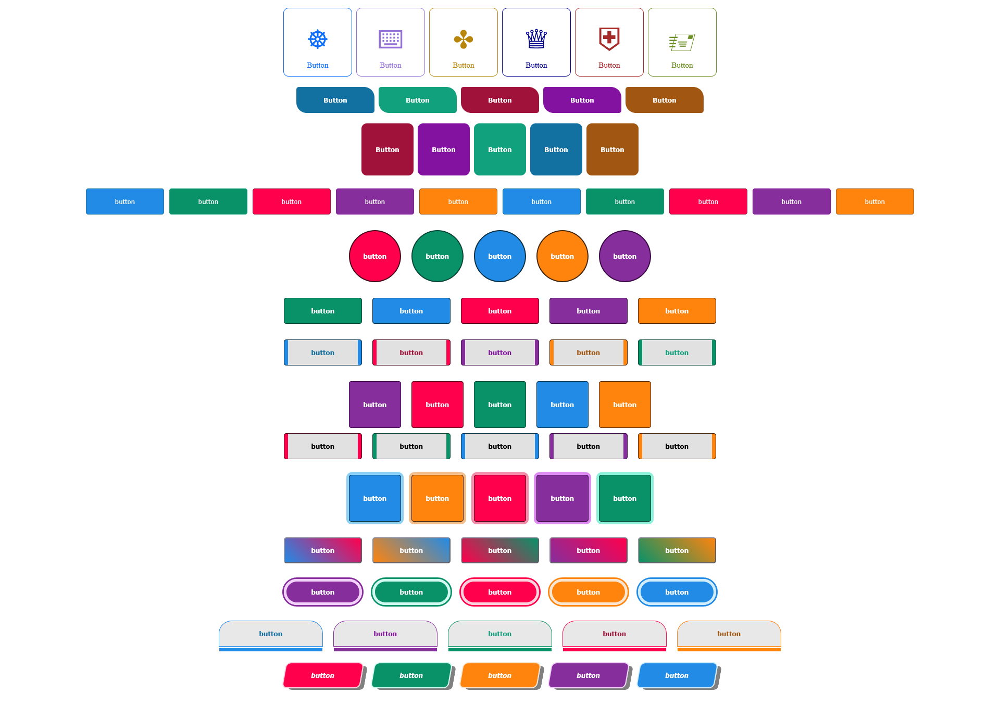
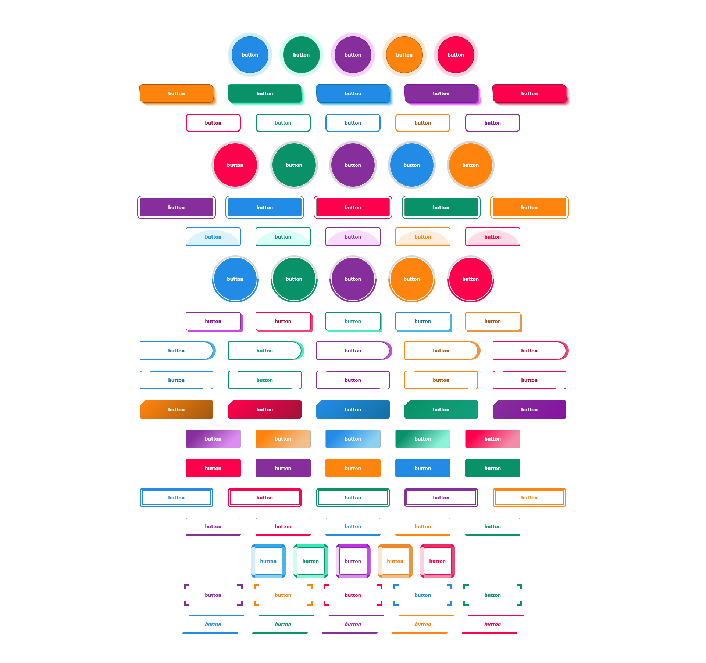
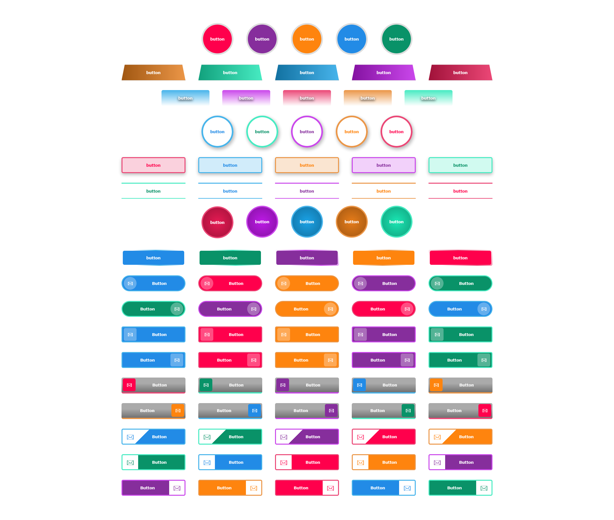

# ⚡DihokButtons

A collection of 46 modern button components built entirely with Pure CSS.  
DihokButtons is a lightweight, zero-dependency CSS button library designed to save you hours of styling time. Whether you're building a quick prototype or a production-grade web application, these buttons offer a professional, modern look right out of the box.  


## :sparkles: Features

- 46 unique button designs
- Built with Pure CSS
- No JavaScript required
- No frameworks or libraries
- Easy to customize
- Modern hover and transition effects
- Ready to use

## 📸 Preview
💠First Part of Buttons


 💠Second Part of Buttons


💠Third Part of Buttons

 

## :package: Installation

Clone the repository:

bash  
git clone https://github.com/SirwanCode/dihokbuttons.git


Or download the ZIP file, and then  include the CSS DihokButtons.css in your project.

 ```html
 <link rel="stylesheet" href="css/DihokButtons.css">
```

## :book: Usage

 
✳ sample usage(for button-003)
 ```html
 <button class="dButton-003 dButton-003-red">Button</button>
```
    

➰to change color, just replace class "dButton-003-blue" with one the following  
&nbsp;&nbsp;&nbsp;&nbsp;&#128311; dButton-003-green   
&nbsp;&nbsp;&nbsp;&nbsp;&#128311; dButton-003-red   
&nbsp;&nbsp;&nbsp;&nbsp;&#128311; dButton-003-violet  
&nbsp;&nbsp;&nbsp;&nbsp;&#128311; dButton-003-orange  


✳ sample usage(for button-044)
 ```html
 <button class="dButton-044 dButton-044-blue">
      <span class="icon">&#128386;</span>
      <span class="text">  Button </span>
 </button>
```
 

➰to change color, just replace class "dButton-044-blue" with one the following  
&nbsp;&nbsp;&nbsp;&nbsp;&#128311; dButton-044-green   
&nbsp;&nbsp;&nbsp;&nbsp;&#128311; dButton-044-red   
&nbsp;&nbsp;&nbsp;&nbsp;&#128311; dButton-044-violet  
&nbsp;&nbsp;&nbsp;&nbsp;&#128311; dButton-044-orange      
➰to change direction of button, replace  "dButton-044" with "dButton-044-rtl"  
<h3>📌📌📌 Open index.html and we have listed all buttons and how to add each one📌📌📌</h3>


## :art: Customization

You can easily customize:

- Colors
- Fonts
- Border radius
- Padding
- Shadows
- Hover effects
- Animations
- Transition speed
    
 🔶 just open DihokButtons.css and find the button and change properties    
 💢 to add new Color set:  
      &nbsp;&nbsp;&nbsp;&nbsp;&nbsp; ◼ Open DihokButtons.css  
      &nbsp;&nbsp;&nbsp;&nbsp;&nbsp; ◼ in :root, add new color with differrent brightness  
   ```css
    /* green in HSL */
    --btn-green:#099268;
   --hue-green:165;
   --sat-green:80%;
   --btn-green-900: hsl(var(--hue-green), var(--sat-green), var(--light-900));
   --btn-green-700: hsl(var(--hue-green), var(--sat-green), var(--light-700));
   --btn-green-600: hsl(var(--hue-green), var(--sat-green), var(--light-600));
   --btn-green-500: hsl(var(--hue-green), var(--sat-green), var(--light-500));
   --btn-green-450: hsl(var(--hue-green), var(--sat-green), var(--light-450));
   --btn-green-300: hsl(var(--hue-green), var(--sat-green), var(--light-300));
   --btn-green-100: hsl(var(--hue-green), var(--sat-green), var(--light-100));
   --btn-green-093: hsl(var(--hue-green),  var(--sat-light), var(--light-093));
   ```  
## :file_folder: Project Structure


```
DihokButtons/
├── css/
│   │   └── DihokButtons.css
├── preview/
│   │   └── dihokButtons-001.png
│   │   └── dihokButtons-002.png
│   │   └── dihokButtons-003.png
├── index.html
├── README.md
 
```


## :computer: Built With

- HTML5
- CSS3
   
## 🎯  Purpose

I built this to have a go-to set of buttons that look great without relying on heavy frameworks like Bootstrap or Tailwind. It's perfect for portfolio sites, dashboards, or any side project where you want clean UI without the bloat.  

## 🤝 Contributing

Contributions are welcome!

If you'd like to improve DihokButtons or add new button styles:

1. Fork the repository
2. Create a feature branch
3. Commit your changes
4. Open a Pull Request

## :star: Support

If you like this project, consider giving it a star on GitHub. Your support helps the project grow and encourages future updates.
 

 
